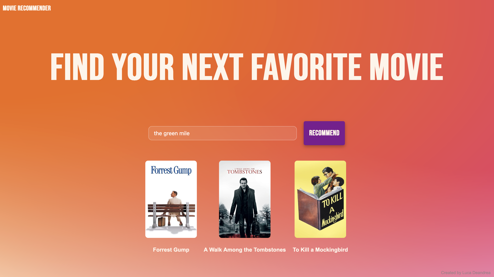

# Movie Recommendation System

A web-based movie recommendation system that suggests similar movies based on user input, combining matrix factorization with a sleek, responsive user interface.

## Demo



## Features

- Content-based movie recommendations using multiple features:
  - Genres
  - Keywords
  - Taglines
  - Cast
  - Director
- Responsive web interface with modern design
- Real-time recommendations using TF-IDF matrix factorization
- Popularity-based ranking of suggestions
- Use of TMDB posters for appealing interface
- Fuzzy string matching for user-friendly input

## Tech Stack

- **Backend**
  - Python 3.x
  - Flask - Web framework
  - pandas - Data manipulation
  - scikit-learn - Machine learning operations
  - NumPy - Numerical computing
  
- **Frontend**
  - HTML5
  - CSS3
  - JavaScript (AJAX for async requests)
  - Custom fonts

## Project Structure

```
movie-recommender/
│
├── app.py                 # Flask application
├── movie_recommender.py   # Recommendation engine
├── movie_reco.ipynb       # Detailed explaination of the recommendation engine
├── static/
│   ├── styles.css         # CSS styling
│   └── Bebasneue.ttf      # Custom font
├── templates/
│   └── index.html         # Main webpage
└── movies.csv             # Dataset
```

## How It Works

1. **Data Processing**: 
   - Loads and preprocesses movie data
   - Combines selected features into a single text representation
   - Converts text data into TF-IDF vectors

2. **Recommendation Algorithm**:
   - Calculates cosine similarity between all movies
   - Finds close matches to user input
   - Ranks similar movies by popularity

3. **Web Interface**:
   - User enters a movie title
   - AJAX request sends the title to the Flask backend
   - Backend processes the request and returns recommendations
   - TMDB API request the poster and send it to the frontend
   - Frontend displays the results with a visual animation

## Installation

```bash
# Clone the repository
git clone https://github.com/yourusername/movie-recommender.git

# Navigate to the project directory
cd movie-recommender

# Install required packages
pip install -r requirements.txt

# Run the application
python app.py
```

## Usage

1. Open your web browser and go to `http://localhost:5000`
2. Enter a movie title in the search box
3. Click "Get Recommendations" or press Enter
4. View your personalized movie recommendations

## API Endpoints

### `POST /recommend`

Receives a movie title and returns recommendations.

**Request Body:**
```json
{
  "movie": "The Dark Knight"
}
```

**Response:**
```json
[
  "Batman Begins",
  "Inception",
  "The Dark Knight Rises"
]
```

## The Dataset

The system requires a `movies.csv` file with the following columns:
- title
- genres
- keywords
- tagline
- cast
- director
- popularity
- index

## Styling

The application features a carefully crafted UI with:
- Gradient background with SVG illustration
- Custom typography using Uni Sans Heavy font
- Responsive design for various screen sizes
- Animated buttons and card shadowss

## Future Improvements

- User accounts and personalized history
- Collaborative filtering implementation
- Movie posters and additional metadata
- Mobile app development
- Performance optimization for larger datasets

## License

This project is licensed under the MIT License - see the LICENSE file for details.

## Credits

Created by Luca Deandrea

