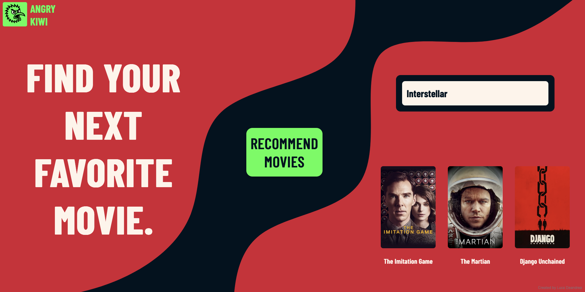

# Movie Recommendation System

A collaborative filtering movie recommendation system that suggests similar movies based on user input, combining matrix factorization with a sleek user interface.

## Demo



## Features

- Item-based collaborative movie recommendations built on over 26 milions ratings 
- Responsive web interface with modern design
- Real-time recommendations using memory-efficient dimentionality reduction
- Use of TMDB posters for appealing interface
- Fuzzy string matching for user-friendly input

## Tech Stack

- **Backend**
  - Python 3.x
  - Flask - Web framework
  - pandas - Data manipulation
  - scikit-learn - Machine learning operations
  - NumPy - Numerical computing
  
- **Frontend**
  - HTML5
  - CSS3
  - JavaScript (AJAX for async requests)
  - Custom fonts

## Project Structure

```
movie-recommender/
│
├── app.py                 # Flask application
├── preprocess.ipynb       # Creation of the tools for recommendation
├── static/
│   ├── styles.css         # CSS styling
│   └── ...                # Other Images used in the webpage
├── templates/
│   └── index.html         # Main webpage
├── dataset/               # Kaggle "The movie dataset"
└── requirements.txt       # Required libraries
```

## How It Works

Dowload the dataset [here](https://www.kaggle.com/datasets/rounakbanik/the-movies-dataset)


1. **Data Processing**: 
   - Loads and preprocesses movie data and ratings¨
   - Creates compressed sparse user-movie matrix 
   - Reduce matrix dimention by SVD truncation

2. **Recommendation Algorithm**:
   - Finds close matches to user input
   - Calculates cosine similarity between user movie and all other movies
   - Ranks movies by similarity and select top n

3. **Web Interface**:
   - User enters a movie title
   - AJAX request sends the title to the Flask backend
   - Backend processes the request and returns recommendations
   - TMDB API request the poster and send it to the frontend
   - Frontend displays the results with a visual animation

## Installation

```bash
# Clone the repository
git clone https://github.com/LeanderCauda/movie_recommender.git

# Navigate to the project directory
cd movie-recommender

# Install required packages
pip install -r requirements.txt

# Go to Kaggle, download the dataset and rename it as dataset

# Run the application
python3 app.py
```

## Usage

1. Open your web browser and go to `http://localhost:5000`
2. Enter a movie title in the search box
3. Click "Recommend movies" or press Enter
4. View your personalized movie recommendations

## API Endpoints

### `POST /recommend`

Receives a movie title and returns recommendations.

**Request Body:**
```json
{
  "movie": "The Dark Knight"
}
```

**Response:**
```json
[
  "Batman Begins",
  "Inception",
  "The Dark Knight Rises"
]
```

## The Dataset

The dataset is the "Movie Dataset" from Kaggle and it can be downloaded [here](https://www.kaggle.com/datasets/rounakbanik/the-movies-dataset)

The system requires a `dataset` folder with the Kaggle movie dataset that contains the following files:
- `credits.csv`
- `keywords.csv`
- `links.csv`
- `links_small.csv`
- `movie_metadata.csv`
- `ratings.csv`
- `ratings_small.csv`

## Styling

The application features a carefully crafted UI with:
- Clean and vibrant palette of colors
- Custom typography using Barlow Condensed font
- Custom background and logo
- Animated buttons, text and card shadows

## Future Improvements

- User accounts and personalized history
- Hybrid filtering implementation
- Movie posters and additional metadata
- Mobile app development

## License

This project is licensed under the MIT License - see the LICENSE file for details.

## Credits

Created by Luca Deandrea

